# Nutz Fast Work

[QQ交流群:671442044](https://shang.qq.com/wpa/qunwpa?idkey=7af5197df45f0db8c78ca89962f0b8ab7cc2f2f0769a25a73528bb14cb1697e4)

[点我在线体验](http://114.67.74.123:8084)
> admin 666666

[开发文档详见wikis](https://gitee.com/threefish/NutzFw/wikis/pages)

#### 介绍
Java开源企业级快速开发框架，拥有完善的权限控制、代码生成器、自定义表单、动态数据库、灵活的工作流、手机APP客户端、支持前后端分离开发。

#### 项目特性
- 可以动态配置数据表实现数据平台中心，
- 支持工作流少量开发快速配置OA系统。
- 采用APP壳方式实现跨平台APP打包，也支持前后端分离开发。
- 强大的数据表逻辑字段和依赖字段可以使用数据库函数计算，可以在不更改代码的情况下实现很多计算功能。
- 数据表数据复杂查询，可以快速进行数据统计及导出。
- 基于（Role-Based Access Control）角色权限，登录即将用户所有可以管理的人员查出进行缓存，方便在具体业务中使用。  
- 工作流采用 Flowable 比 Activiti 更加强大，更加易于扩展。本项目开发业务时只需要少量代码即可完成，加速业务完成，减少工作量。
- 服务器监控，对于服务器资源监控出现异常时可以邮件通知管理员。
- 首页门户动态配置图表满足领导宏观可视化需求。

#### 功能列表

- [x] 1 在线表单管理---(优化安排：添加表引用字段)
- [x] 2 数据字典管理
- [x] 2 数据表数据复杂查询
- [x] 3 组织架构管理---(优化安排：需要重构)
- [x] 4 用户管理---(优化安排：需要重构)
- [x] 5 角色权限管理、精细化人员管理范围
- [x] 6 Nutz国际化
- [x] 7 邮件管理（可配置3个免费邮箱发送邮件）
- [x] 8 新闻管理
- [x] 9 首页门户配置---(优化安排：需要重构)
- [x] 10 oshi 服务器状态监控
- [x] 11 druid监控
- [x] 12 redis集成
- [x] 13 系统信息配置
- [x] 14 日志记录查看
- [x] 15 定时任务管理
- [x] 16 移动端APP支持（HBuilder WEB APP打包指向登录页面即可）
- [x] 17 APP扫码登录
- [x] 18 数据库定时自动备份
- [x] 19 采用webscokets推送业务消息
- [x] 20 采用webscokets推送基于shell的实时日志监控
- [x] 21 redis缓存管理
- [x] 22 附件管理
- [x] 23 人员异动（部门岗位调整）（优化安排：流程需要使用工作流调整）
- [x] 24 个人资料维护（优化安排：流程需要使用工作流调整）
- [x] 25 通讯录（优化安排：需要重构）
- [ ] 25 将现有的POI操作工具类分离，重构出一个POI操作工具为独立模块（模版式导入、导出）
- [x] 26 授权管理(license)
- [x] 27 标准化CAS接入
- [x] 28 Flowable 工作流深度定制（可以实现快速配置开发）
    - [x] 0 我的任务
        - [x] 1 发起任务
        - [x] 2 待办、待签任务
        - [x] 3 已发任务
        - [x] 4 已办任务
    - [x] 1  自定义回退、驳回
    - [x] 2  流程审核人范围控制
    - [x] 3  自由选择下一步审核人
    - [x] 4  手写签字
    - [x] 5  多实例(会签)加签
    - [ ] 6  多实例(会签)减签
    - [x] 7  委托任务
    - [x] 8  转派任务
    - [ ] 9  自动委托(全局自动委托)
    - [ ] 10 流程催办
    - [ ] 11 流程作废
    - [ ] 12 流程撤回
    - [ ] 13 中国式流程加签
    - [ ] 14 流程任务管理员全局管理
        - [ ] 1 指派给任意人员
    - [ ] 13 在线表单集成工作流实现OA
        - [ ] 1 在线表单设计器 
            - [ ] PC表单         
            - [ ] APP表单         
- [ ] 29 在线报表
    - [ ] 1 SQL模式统计报表（自定义各种图表）
    - [ ] 2 基于在线表单的统计报表（自定义各种图表）

#### 软件架构

 - 后端技术
 
    | 技术   |      名称      |   |
    |:----------|:-------------|:------|
    | Nutz Framework | 容器|  |
    | Nutz MVC | MVC框架|  |
    | Nutz ORM | ORM框架|  |
    | Nutz-SqlTpL | Sql模版框架|  |
    | Apache Shiro | 安全框架|   |
    | Druid | 	数据库连接池|   |
    | nutz-plugins-validation | 	校验框架 |   |
    | beetl | 	模板引擎 |   |
    | Redis | 	分布式缓存数据库 |   |
    | Quartz | 	作业调度框架 |   |
    | flowable | 工作流引擎|   |
    | Maven | 	项目构建管理 |   |
    | Webscoket | web消息实时推送 |   |
    | swagger | 后端API接口信息 |   |
    | logback | 日志组件 |   |
    | POI 4.0 | excle,word文档操作 |   |
    | j2v8 | 执行JS动态脚本(JDK1.8后使用) |   |
    | NashornJs | 执行JS动态脚本(JDK1.8使用) |   |
    | oshi |服务器状态监控|   |

 - 前端技术（2个版本）
   - 1、基于 ant-design-vue [前后端分离开发](https://gitee.com/threefish/nutzfw-front)（分离版本只开发了登录与权限路由控制  ）
   
   - 2、传统开发模式
    
    | 技术|名称 |   |
    |:----------|:-------------|:------|
    | [AdminLTE](https://almsaeedstudio.com/themes/AdminLTE/index2.html)|UI骨架||
    | Jquery|函式库||
    | [vue.js](https://cn.vuejs.org/v2/guide/)|双向绑定 MVVM||
    | [Bootstrap](http://www.bootcss.com/)|前端UI组件||
    | [layui](http://www.layui.com/)|前端UI组件||
    | [ztree](http://www.treejs.cn/)|树组件||
    | layui.table|表格||
    | [layer](http://layer.layui.com/)|弹窗组件||
    | layui.date|日期插件||
    | [SMValidator](https://github.com/WLDragon/SMValidator)|前端效验插件||
    | [echarts](http://echarts.baidu.com/)|前端图表||
    | Font Awesome |前端图标||
    | common.js |前端核心封装（弹窗树、统一文件上传、消息弹窗等）||
    |[iCheck](http://www.bootcss.com/p/icheck/) |单选框复选框美化|
    | magic-check |单选框复选框美化|
    | webuploader |文件上传|
    | MUI | HBuilder WEB APP打包可以产出IOS、android APP |

#### 运行环境

* JDK 8u221 + 
* Maven 3.3.9 +
* Redis 3.2.100 +
* MariaDB 10.2 + or MySQL 5.7 +
* lombok 1.18.4 +

#### IDEA 开发环境
* [Lombok plugin](https://github.com/mplushnikov/lombok-intellij-plugin) 开发利器
* NutzCodeInsight [Nutz框架插件](https://plugins.jetbrains.com/plugin/10311-nutzcodeinsight)
* NutzFw Code Generat [NutzFw代码生成器插件](https://plugins.jetbrains.com/plugin/11575-nutzfw-code-generat)

#### 模块说明

| 模块   |      描述      |  备注 |
|:----------|:-------------|:------|
| nutzfw-common|MVC核心||
| nutzfw-license|产品授权管理|非开源|
| nutzfw-web-admin|web核心包||
| nutzfw-web-user-front|无需登录的用户前台|包含用户采用邮箱验证码注册|
| nutzfw-web-flowable|工作流深度订制| gitee & github start 100+ 再开源 |
| nutzfw-web-oa|oa工作流| 基于nutzfw-web-flowable模块 |
| test|测试包||

#### 效果图
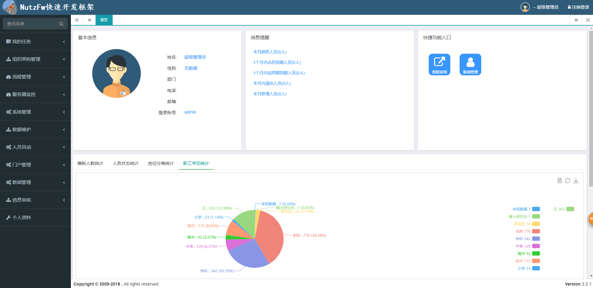
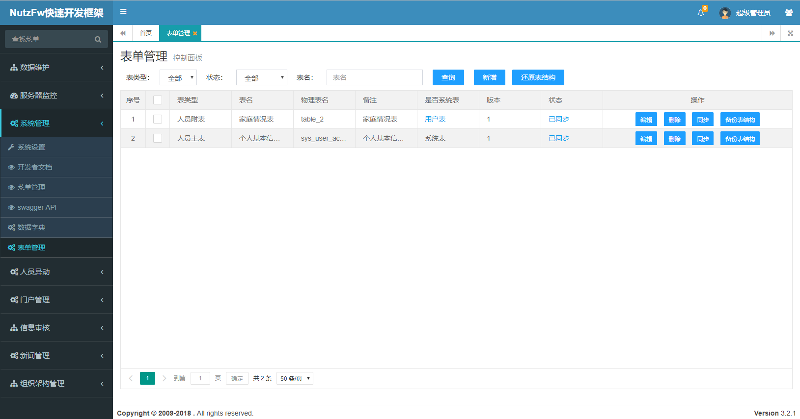
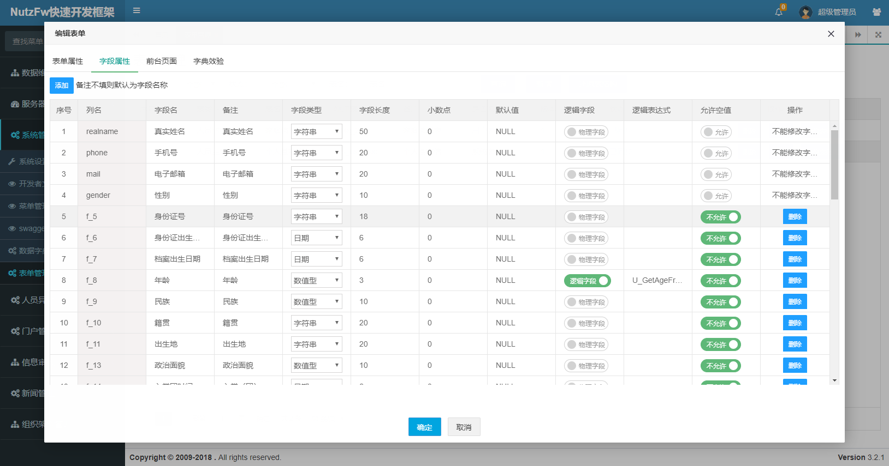
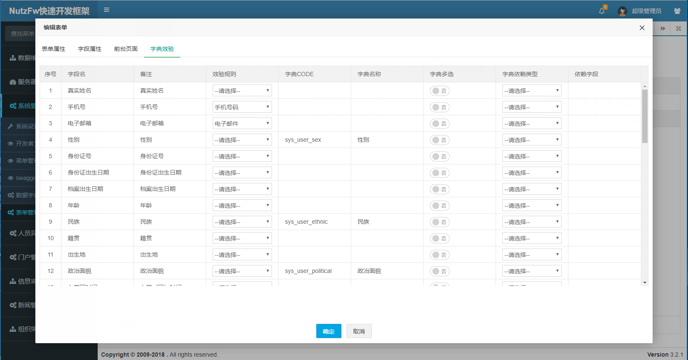
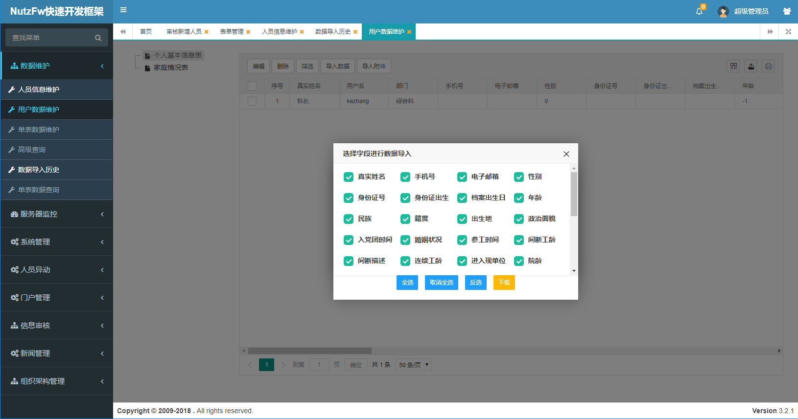
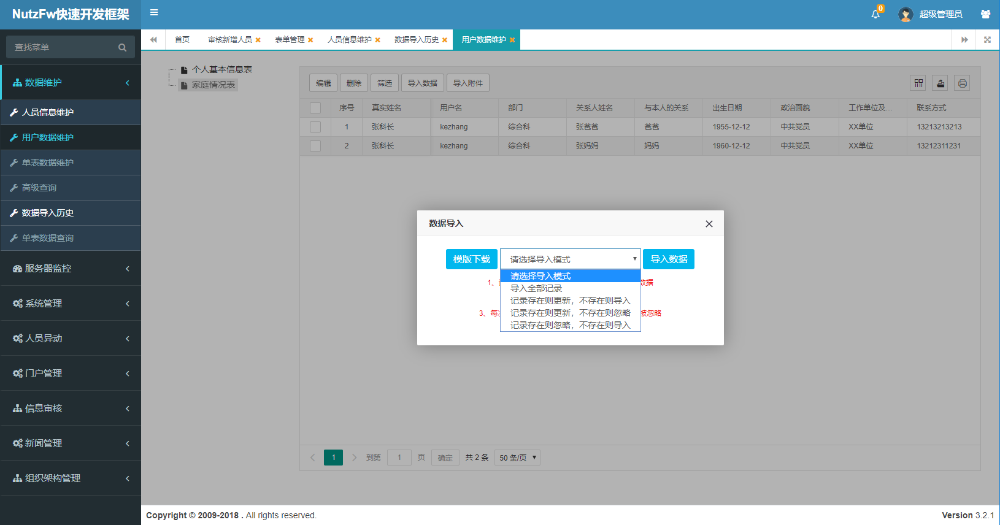
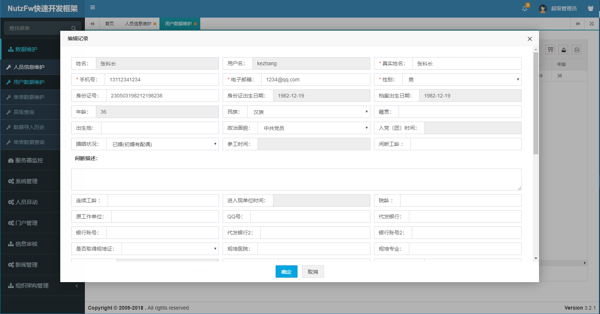
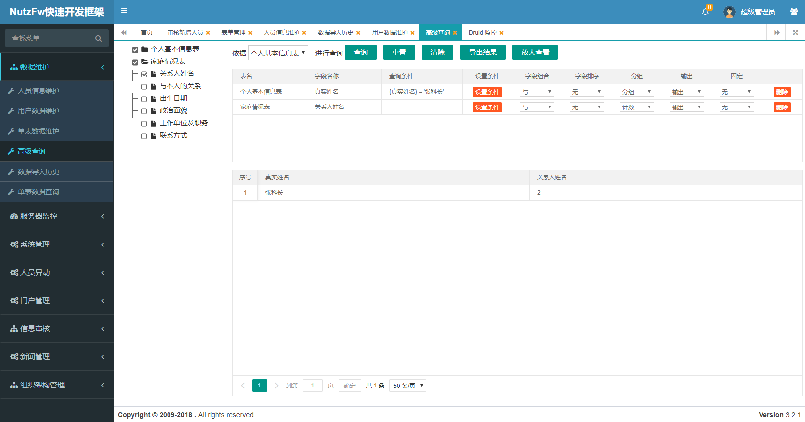
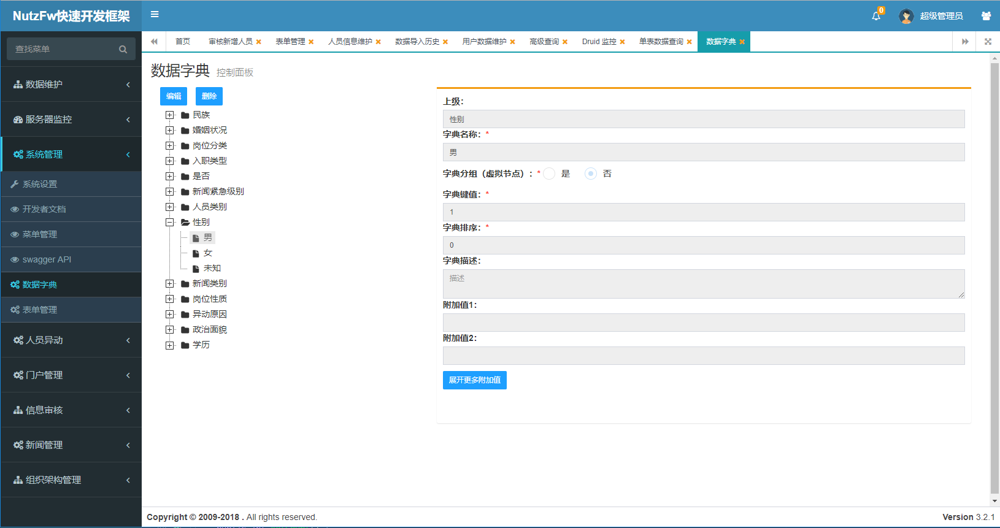
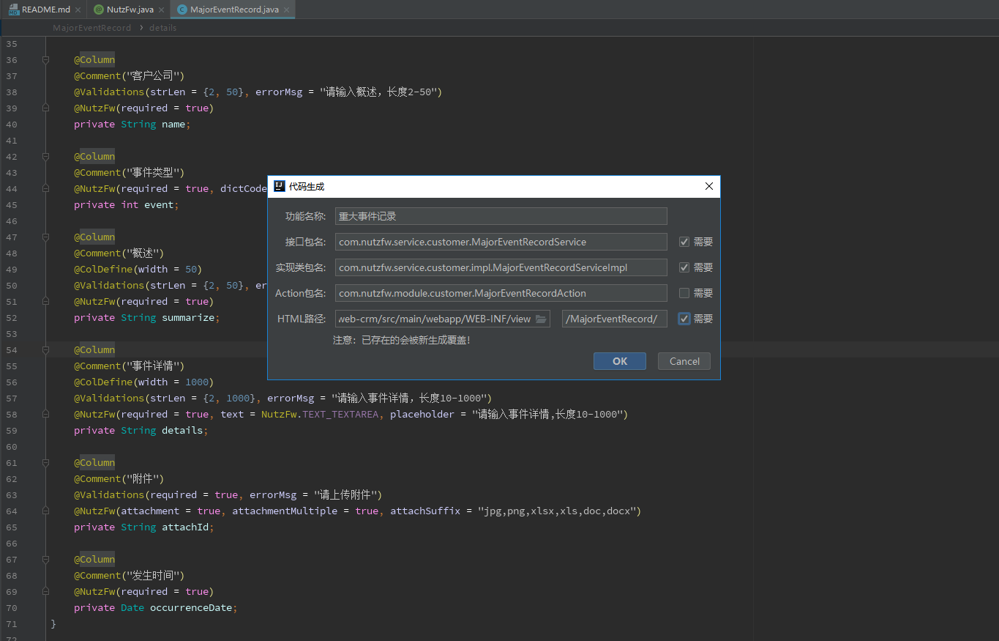

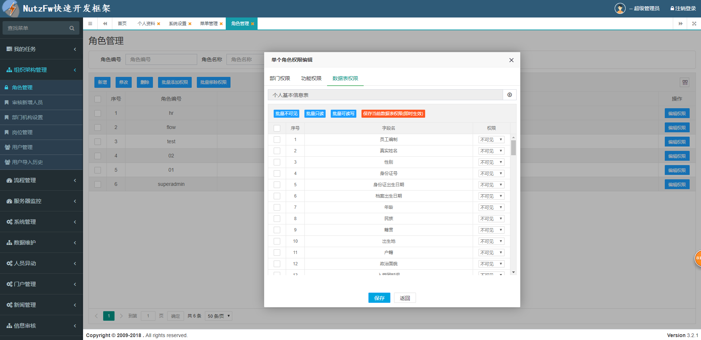
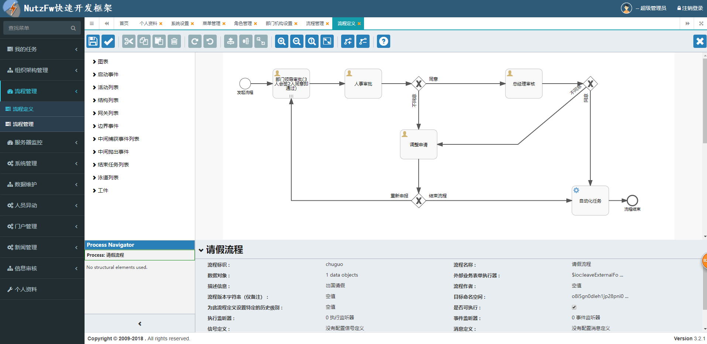
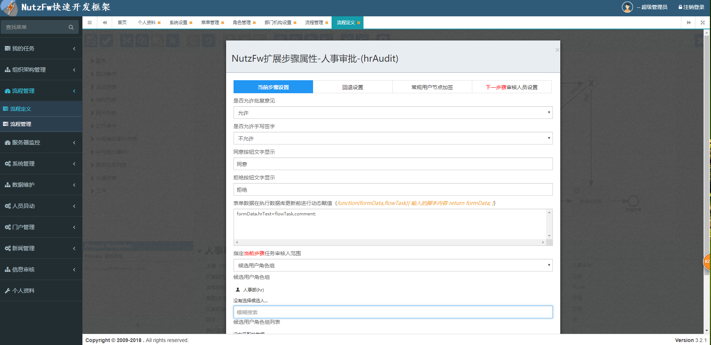
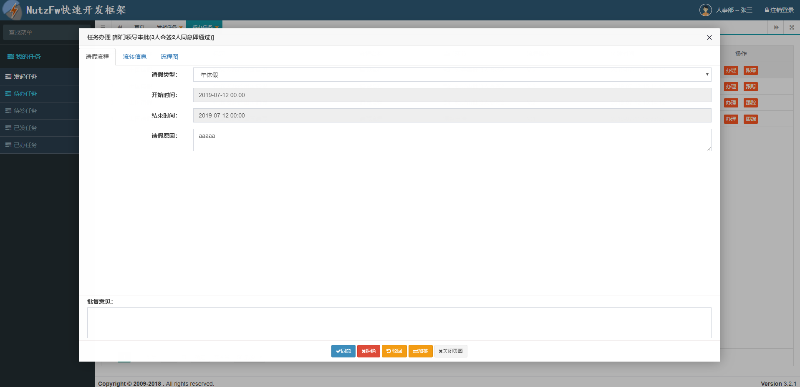
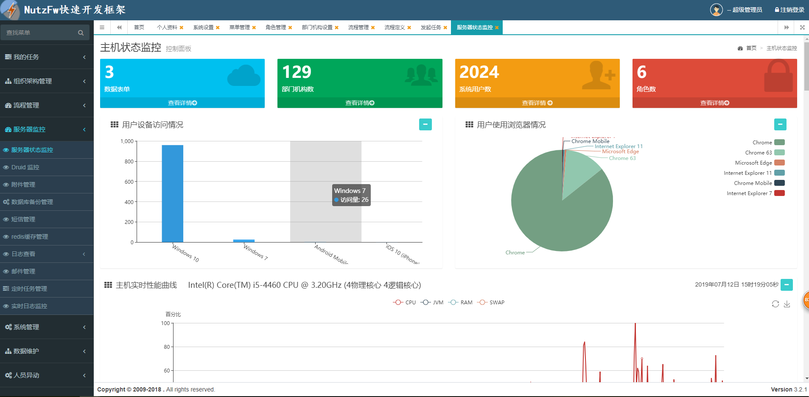

#### 欢迎打赏
